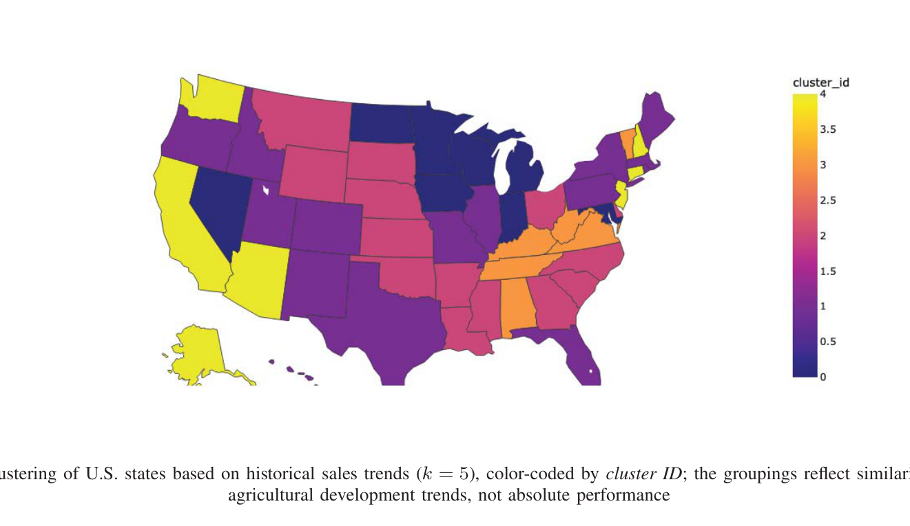
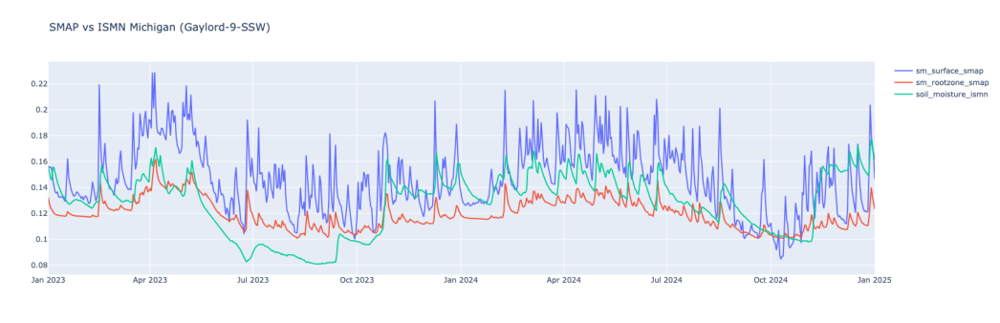

[← Back to Research](index.qmd)

Applying AI and data-driven methods to important scientific, environmental, agricultural, and healthcare problems.

{width=85% fig-align="center"}

_Figure: K-means clustering (k = 5) of U.S. states by historical agricultural sales trends. Source: Hasan and Juma (2026), Fig. 8._

{width=77% fig-align="center"}

_Figure: Average daily soil moisture from SMAP (surface and root-zone) compared with an ISMN in-situ station at Gaylord-9-SSW, Michigan. Source: Hasan and Muiruri (2025), Fig. 1._

## Research Topics

- Precision agriculture
- Soil-moisture monitoring and prediction
- Remote sensing and Earth observation
- Environmental and climate analytics
- Healthcare and medical AI
- Data-driven decision support

## Key Research Questions

- How can satellite data and sparse local sensor networks improve soil-moisture prediction?
- How can machine learning reveal patterns in heterogeneous public health and environmental data?

## Current Projects

- Mapping urban heat islands and environmental inequity in West Michigan
- Higher-resolution soil-moisture prediction using satellite data and sparse local sensor networks
- Development and clinical validation of an AI-powered diagnostic tool for dental caries

## Selected Publications

**Soil Moisture Prediction and Benchmark Reliability: A Review with Multi-Site SMAP–ISMN Analysis**
K. Hasan, C. Mutegi, A. Muiruri, P. K. Amudala, A. Njiyo. _International Journal On Advances in Intelligent Systems_, 19(1&2), 2026.

**Beyond Conventional Surveys: A Machine Learning Approach to Understanding Precision Agriculture Adoption in the U.S.**
K. Hasan, D. Juma. _International Journal of Agricultural and Biosystems Engineering_, 20(2), 2026.

**Predictive Modeling of Soil Moisture: A Review of Benchmark Datasets, Their Strengths, and Limitations**
K. Hasan, A. Muiruri. _International Conference on Sustainable and Regenerative Farming (CSRF)_, 2025.

**Towards Intelligent NICU Monitoring: Real-Time Anomaly Detection in Vital Signs Using Deep Learning Models**
P. Thatoi, R. Choudhary, A. L. Selvarathinam, S. D. S. Azariya, K. Hasan. _7th AI and Cloud Computing Conference_, pp. 573–582, 2024. [DOI](https://doi.org/10.1145/3719384.3719467)

**Status of Malaria in the African Continent: Data Mining Insights from Heterogeneous but Interrelated Data Sources**
K. Muchira, H. Sabbineni, J. M. Bollarapu, K. Hasan. _Computer Science and Information Technology (CSIT)_, 2024. [DOI](https://doi.org/10.5121/csit.2024.141401)

