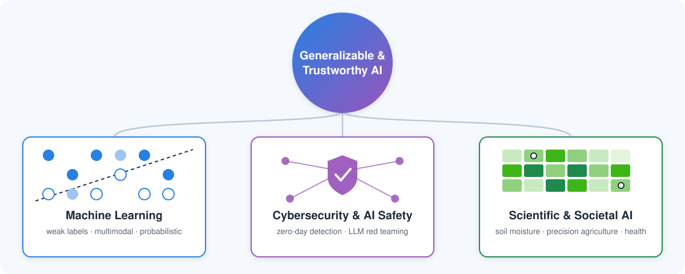

My research develops **generalizable and trustworthy AI methods** and applies them to complex scientific and societal problems. I work with heterogeneous, limited, and uncertain data, including images, sensor observations, satellite imagery, text, and geospatial information, to build models that hold up beyond their training data.

{width=100%}

::: {.grid}

::: {.g-col-12 .g-col-md-4 .research-card}
### Generalizable & Trustworthy Machine Learning

Machine learning and AI methods that generalize beyond their training data and work with limited, heterogeneous, uncertain, or multimodal data.

[Explore this track →](ml.qmd)
:::

::: {.g-col-12 .g-col-md-4 .research-card}
### AI for Cybersecurity & AI Safety

Applying AI to cybersecurity, and building secure and trustworthy AI systems, including zero-day threat detection and LLM red teaming.

[Explore this track →](cybersecurity.qmd)
:::

::: {.g-col-12 .g-col-md-4 .research-card}
### AI for Scientific & Societal Applications

Data-driven methods for precision agriculture, environmental and climate analytics, and healthcare.

[Explore this track →](applications.qmd)
:::

:::
