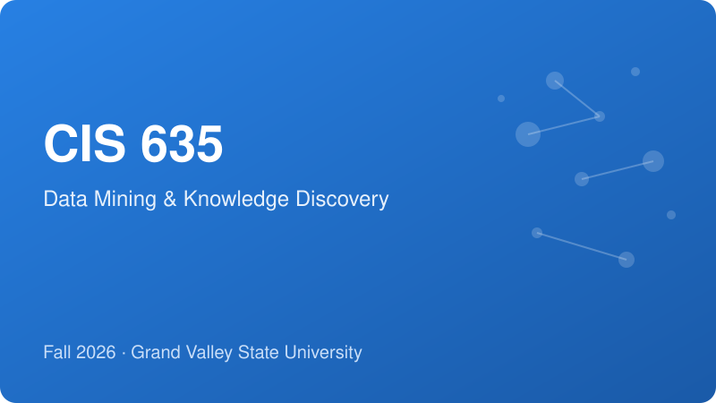
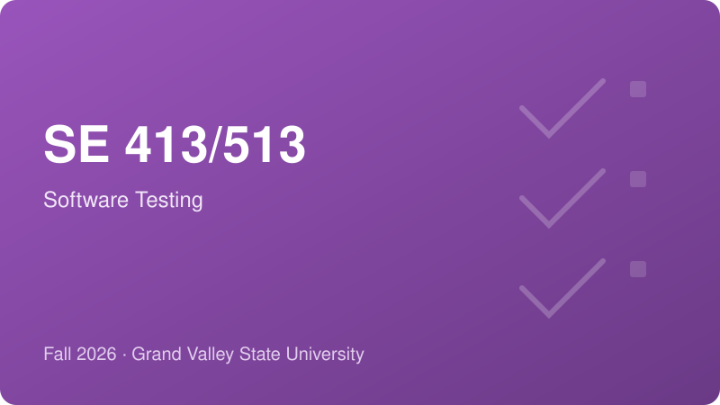

Courses I am currently teaching at Grand Valley State University. Course repositories on GitHub contain lecture slides, notebooks, and other supporting materials; official announcements, assignments, and grades are handled through Blackboard.

## Fall 2026

::: {.grid}

::: {.g-col-12 .g-col-md-6 .course-card}
{.course-thumb}

### CIS 635 — Data Mining and Knowledge Discovery

An introduction to computational methods for knowledge discovery and data mining, covering data preparation, exploratory data analysis, predictive modeling, clustering, and association analysis using Python.

- [Syllabus](https://github.com/mdkamrulhasan/data_mining_kdd/blob/main/doc/CIS-635_Syllabus-Fall-2026.pdf)
- [Schedule](https://github.com/mdkamrulhasan/data_mining_kdd/blob/main/doc/CIS-635_Schedule-Fall-2026.pdf)
- [Lecture Slides & Notebooks](https://github.com/mdkamrulhasan/data_mining_kdd/tree/main/presentation/F26)
- [GitHub Repository](https://github.com/mdkamrulhasan/data_mining_kdd)
:::

::: {.g-col-12 .g-col-md-6 .course-card}
{.course-thumb}

### SE 413/513 — Software Testing

An introduction to fundamental software testing principles and their practical application using Python-based testing tools, covering test design, automation, and evaluation across the software development lifecycle.

- [Syllabus](https://github.com/mdkamrulhasan/software-testing/blob/main/docs/SE-413-513_Syllabus-Fall-2026.pdf)
- [Schedule](https://github.com/mdkamrulhasan/software-testing/blob/main/docs/SE-413-513_Schedule-Fall-2026.pdf)
- [Lecture Slides](https://github.com/mdkamrulhasan/software-testing/tree/main/lectures/F26)
- [GitHub Repository](https://github.com/mdkamrulhasan/software-testing)
:::

:::
